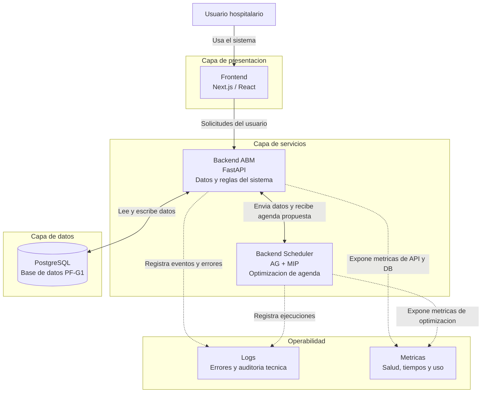
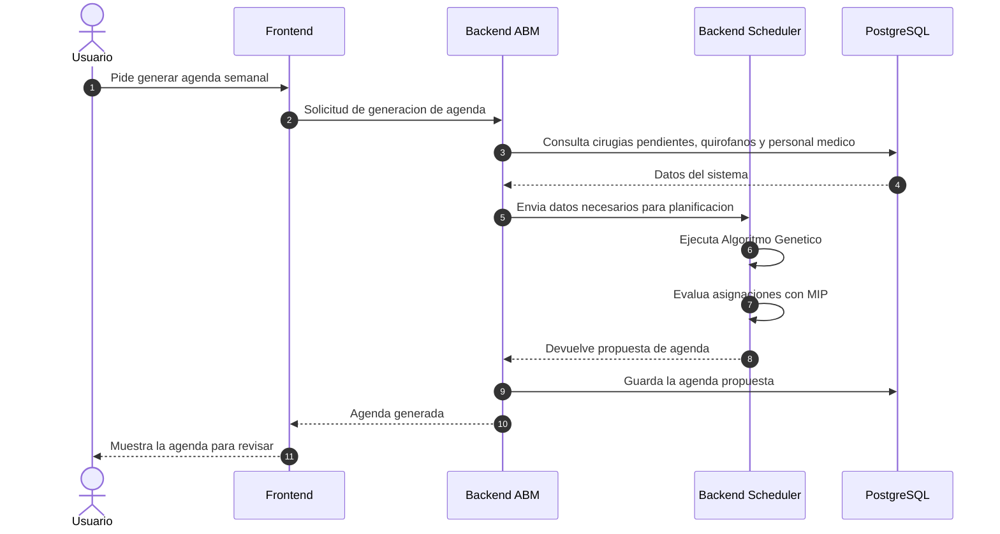

# Diagrama tecnico de arquitectura simple

## Vista general



## Responsabilidad de cada componente

| Componente | Responsabilidad principal | Que NO hace |
| --- | --- | --- |
| Frontend | Muestra la interfaz del sistema, permite iniciar sesion, gestionar cirugias y pedir la generacion de agenda a traves del Backend ABM. | No guarda datos directamente, no accede al Scheduler y no ejecuta el algoritmo de optimizacion. |
| Backend ABM | Administra los datos centrales del sistema: usuarios, pacientes, cirugias, quirofanos, personal medico, disponibilidad e insumos. Es el unico servicio que consulta directamente PostgreSQL y tambien coordina la comunicacion con el Scheduler. | No resuelve la agenda optima; delega la optimizacion al Backend Scheduler. |
| Backend Scheduler | Ejecuta el algoritmo de planificacion quirurgica. Consume los datos del ABM, corre el Algoritmo Genetico y el modelo MIP, y devuelve una propuesta de agenda. | No accede directo a la base de datos y no administra usuarios ni ABM de entidades. |
| PostgreSQL | Guarda la informacion persistente del sistema. | No contiene logica de negocio ni ejecuta procesos de planificacion. |
| Logs | Registran errores, eventos tecnicos y ejecuciones relevantes para diagnostico. | No reemplazan la base de datos ni guardan informacion transaccional del negocio. |
| Metricas | Permiten monitorear salud del sistema, tiempos de respuesta, uso de recursos y duracion de ejecuciones del scheduler. | No ejecutan logica de negocio ni modifican datos. |

## Limites de responsabilidad

```text
Frontend: experiencia de usuario.
Backend ABM: datos, reglas transaccionales y coordinacion del sistema.
Backend Scheduler: optimizacion de la agenda quirurgica.
PostgreSQL: persistencia de datos.
Logs y metricas: observacion tecnica del sistema.
```

## Direccion de dependencia

```text
Frontend -> Backend ABM -> Backend Scheduler
                  |
                  v
              PostgreSQL
```

El Frontend depende del Backend ABM para operar el sistema. El Scheduler depende del ABM para recibir los datos necesarios, pero no conoce ni consulta directamente la estructura de la base de datos.

## Flujo para generar una agenda



## Regla central de la arquitectura

El Backend ABM es el punto central de comunicacion del sistema. El Frontend no se comunica directamente con el Scheduler: todas las operaciones pasan por el ABM. A su vez, el ABM es el unico servicio que consulta PostgreSQL directamente y le entrega al Scheduler los datos necesarios para planificar. Esta separacion deja clara la responsabilidad de cada backend y evita que el servicio de optimizacion dependa del modelo interno de la base de datos.

## Entrada y salida del Scheduler

```text
Entrada
- Cirugias pendientes.
- Quirofanos disponibles.
- Personal medico.
- Disponibilidades.
- Restricciones del dominio.
- Semana a planificar.

Salida
- Propuesta de agenda quirurgica.
- Cirugias planificadas.
- Cirugias no planificadas.
- Motivos de no asignacion, si corresponde.
- Resumen de ejecucion del algoritmo.
```

## Por que separar ABM y Scheduler

El Scheduler se separa porque ejecuta logica computacional pesada y especializada. El Backend ABM conserva la responsabilidad sobre los datos, las reglas transaccionales y la comunicacion con el Frontend. Esta separacion permite modificar o mejorar el algoritmo sin afectar directamente el ABM ni el modelo de base de datos.

## Operabilidad

La arquitectura incorpora logs y metricas como una capa de soporte para poder operar el sistema y detectar problemas.

```text
Logs recomendados
- Inicio y fin de requests importantes.
- Errores de autenticacion, validacion y base de datos.
- Inicio, fin y resultado de cada ejecucion del scheduler.
- Fallos del algoritmo o casos en los que no se pudo generar una agenda factible.

Metricas recomendadas
- Estado de salud de cada backend.
- Tiempo de respuesta por operacion.
- Cantidad de solicitudes por operacion.
- Errores 4xx y 5xx.
- Tiempo total de ejecucion del scheduler.
- Cantidad de cirugias planificadas y no planificadas.
- Uso de CPU y memoria durante la optimizacion.
```

## Comunicacion entre componentes

```text
Frontend -> Backend ABM
- El usuario opera siempre desde el Frontend.
- El Frontend envia todas las solicitudes al Backend ABM.

Backend ABM -> PostgreSQL
- El ABM lee y escribe los datos persistentes del sistema.

Backend ABM -> Backend Scheduler
- El ABM solicita la generacion de agenda.
- El ABM le entrega al Scheduler los datos necesarios para ejecutar el algoritmo.

Backend Scheduler -> Backend ABM
- El Scheduler devuelve una propuesta de agenda.
- El ABM valida, registra y expone esa propuesta al Frontend.
```
